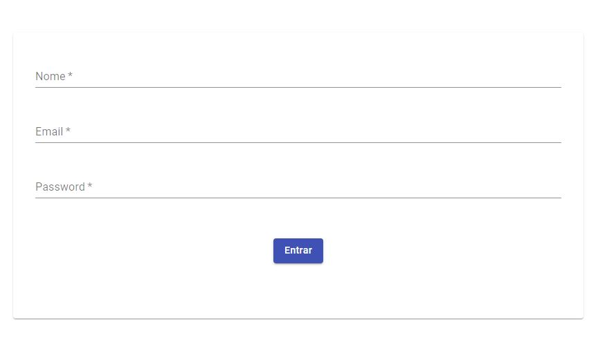
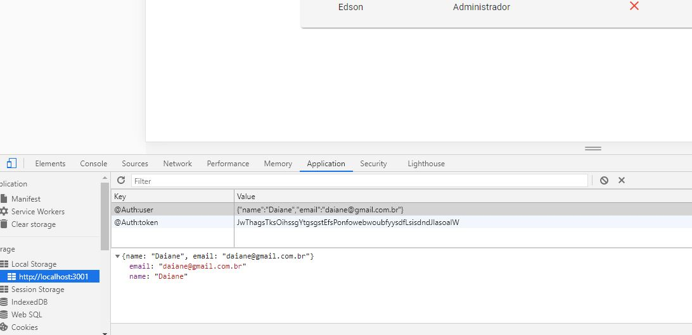
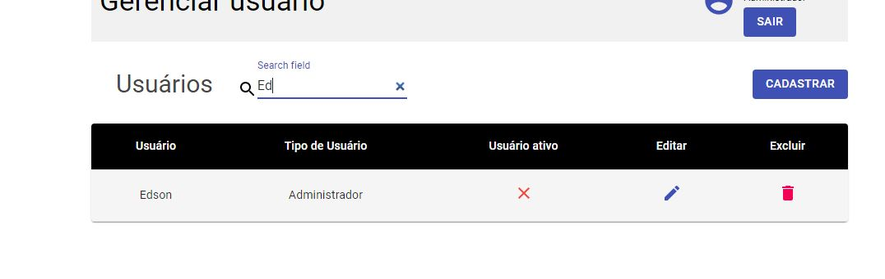
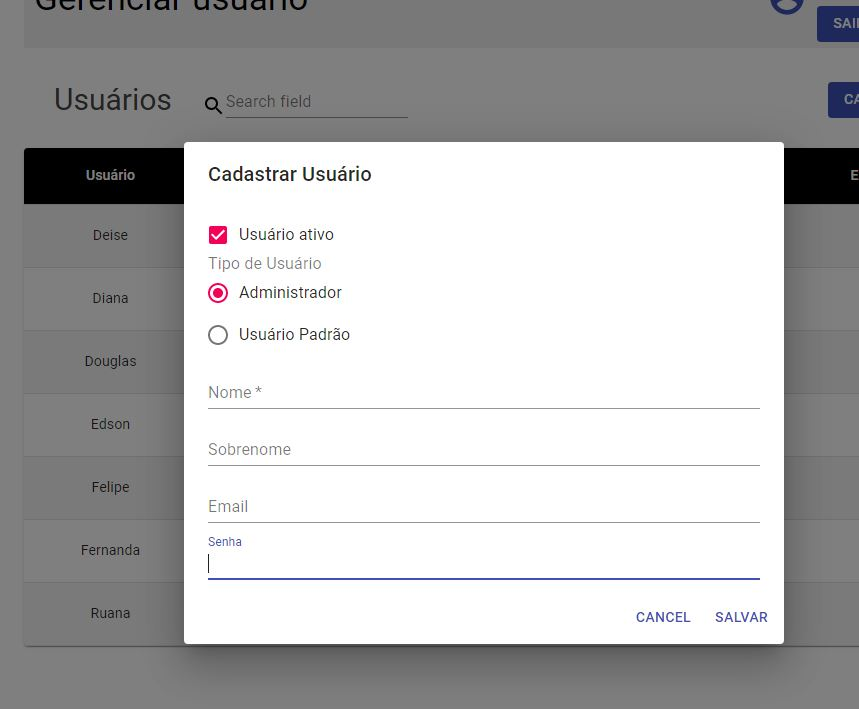
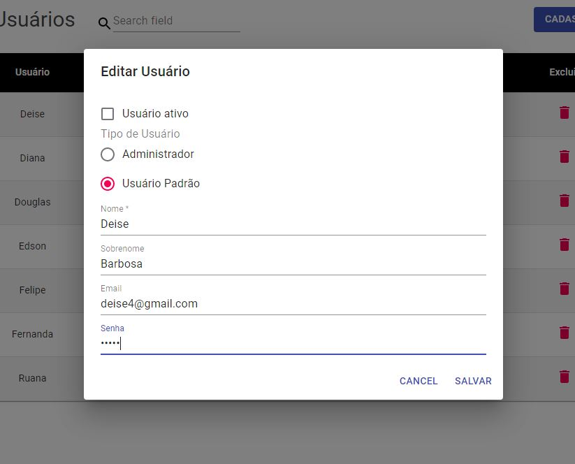
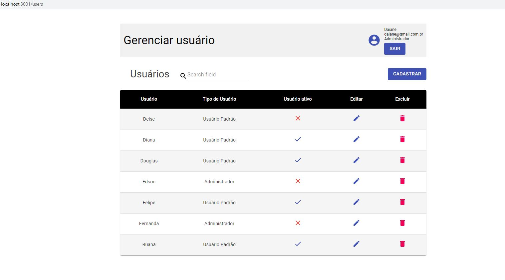

# crud-react

##### `yarn start` ou `npm start`

Para rodar a aplicação front-end.\
Abra [http://localhost:3001](http://localhost:3001) para ver no browser.

##### `json-server --watch db.json`

Para rodar o back-end.\
[http://localhost:3000](http://localhost:3000)

Tecnologias:

- React Hooks
- React UI framework
- React Context API
- Style-components

## Telas

    
    
    
    
    
    
    

